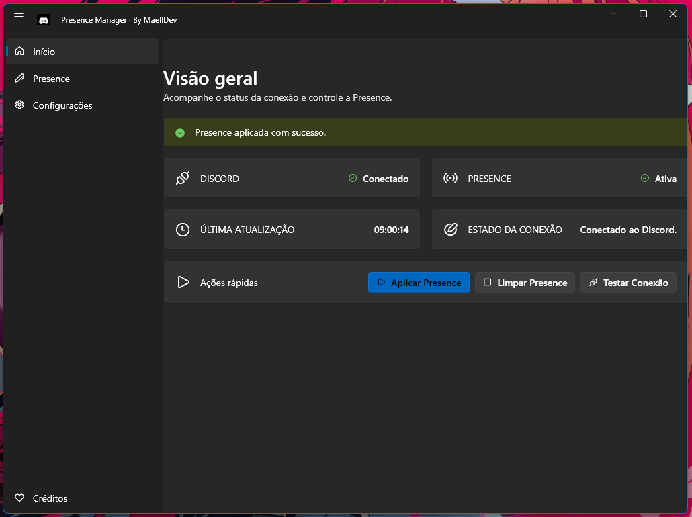
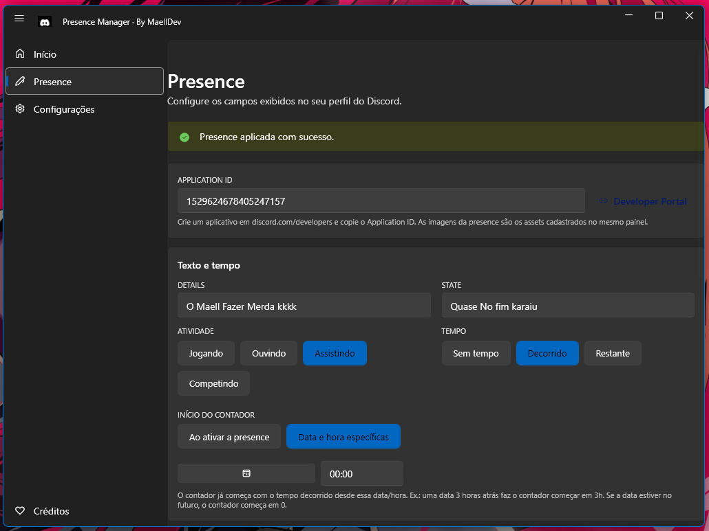
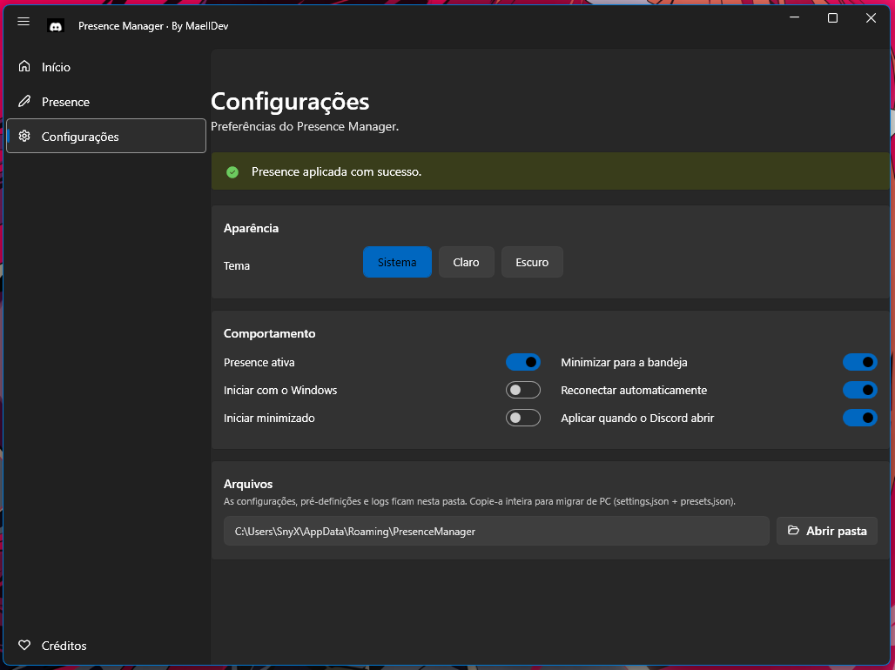

<div align="center">

# Presence Manager

**A modern Windows application for creating and managing custom Discord Rich Presence.**

Set up your Discord status with custom text, activity type, images, timers and buttons — Presence Manager connects to Discord automatically and keeps your presence in sync.

</div>

---

## Overview

Presence Manager lets you create a personalized Discord Rich Presence without touching the Discord client itself. You configure everything through a clean, modern interface (Windows 11 style, light and dark themes), and the application handles the connection: it detects when Discord is running, connects via the official Rich Presence protocol, applies your presence, and reconnects automatically if the connection is lost.

## Features

- **Custom Rich Presence** — details, state, activity type (Playing / Listening / Watching / Competing), large and small images with hover text.
- **Timers** — show elapsed time, remaining time, or no timer at all. The elapsed counter can start at the moment you activate the presence or at a specific date and time.
- **Custom buttons** — up to two buttons with label and URL.
- **Presets** — save named combinations of all fields and apply them instantly with one click.
- **Automatic Discord detection** — monitors whether Discord is open (stable, PTB and Canary).
- **Automatic reconnection** — reconnects and re-applies your presence automatically.
- **System tray** — minimize to the tray, keep running in the background, apply or toggle the presence from the tray menu.
- **Start with Windows** — optional, without requiring administrator privileges.
- **Light / Dark / System themes** — modern Windows 11 style interface.
- **Persistent settings** — everything is saved locally in JSON.
- **Open settings folder** — easy access to your configuration files for backup or moving to another PC.

## Screenshots

### Dashboard



### Presence editor



### Settings



## Download

Presence Manager is distributed as compiled binaries through the GitHub Releases page.

[](https://github.com/MaelllDev/PresenceManager/releases/latest) [](https://github.com/MaelllDev/PresenceManager/issues)

> **Note:** the first release is being prepared. As soon as it is published, the button above will link to the latest version.

You can also browse all releases here: [Releases](https://github.com/MaelllDev/PresenceManager/releases)

## Installation

### Portable version

1. Download the latest release from the [Releases page](https://github.com/MaelllDev/PresenceManager/releases).
2. Extract the downloaded archive to a folder of your choice.
3. Run `PresenceManager.exe`.

No installation required. Your settings are stored separately in your user profile, so updating the application (replacing the files) keeps your configuration intact.

> An installer is not available yet; the portable version is currently the only distribution format.

## Requirements

- **Windows 10 or Windows 11**.
- **Discord Desktop** installed and running (Presence Manager needs Discord open to apply the presence).
- An internet connection while connecting to Discord.

## Discord Setup

Presence Manager uses Discord's official Rich Presence feature, which requires an **Application ID** from the Discord Developer Portal:

1. Open the [Discord Developer Portal](https://discord.com/developers/applications).
2. Click **New Application**, give it a name, and create it.
3. Copy the **Application ID** from the application's general information page.
4. In Presence Manager, open the **Presence** page and paste the Application ID in the **Application** section.
5. If you want to use images in your presence, add them as **Rich Presence Assets** in the Developer Portal (under *Rich Presence → Art Assets*) and use their names as image keys.

You can open the Developer Portal directly from the application: the **Presence** page has a "Developer Portal" shortcut button.

## Usage

1. Open Presence Manager.
2. Go to the **Presence** page.
3. Paste your **Application ID** (see [Discord Setup](#discord-setup)).
4. Fill in the fields you want: details, state, activity type, images, timer and buttons.
5. Click **Save Configuration** to keep your settings.
6. Make sure Discord Desktop is running.
7. Click **Apply Presence** to show your presence on Discord.

You can check the connection state on the home page (Discord connected / disconnected, presence active / inactive, last update).

### System tray

- **Minimize to tray:** close or minimize the window — the application keeps running in the background (this can be disabled in the settings).
- **Open again:** double-click the tray icon (or select "Open Presence Manager" in the tray menu).
- **Apply the presence from the tray:** use "Apply Presence" in the tray menu.
- **Enable / disable the presence:** use "Enable / Disable Presence" in the tray menu.
- **Exit completely:** choose "Exit" in the tray menu. The application disconnects from Discord and releases all resources.

## Configuration

Settings are stored in the user profile, not in the application folder:

```
%AppData%\PresenceManager\
├── settings.json          (application and presence settings)
├── presets.json           (saved presets)
└── presence-manager.log   (application log)
```

The **Settings** page includes an "Open folder" button that opens this folder directly — copy it entirely to move your configuration to another PC.

## Troubleshooting

Common issues and how to solve them:

| Problem | Solution |
| --- | --- |
| Presence does not appear on Discord | Make sure Discord Desktop is running and that you clicked **Apply Presence**. |
| "Informe o Application ID" error | Paste a valid Application ID on the Presence page (see [Discord Setup](#discord-setup)). |
| Connection fails | Check your internet connection and that Discord is open. Use **Test Connection** on the home page. |
| Discord was closed and the presence disappeared | Expected — Presence Manager reconnects and re-applies automatically when Discord opens again (if the option is enabled). |
| Settings were not saved | Make sure the `%AppData%\PresenceManager` folder is writable. |
| The application does not start with Windows | Enable **Start with Windows** in the settings and keep the application installed in a fixed location. |
| Nothing works and you need details | Check `%AppData%\PresenceManager\presence-manager.log` for error messages. |

More details are available in the [Troubleshooting guide](docs/TROUBLESHOOTING.md).

## FAQ

**Is Presence Manager free?**
Yes, Presence Manager is distributed free of charge.

**Do I need to keep Discord open?**
Yes. Discord must be running for the presence to appear on your profile.

**Does the application modify Discord files?**
No. Presence Manager uses Discord's official Rich Presence protocol and does not modify the Discord client in any way.

**Where are my settings saved?**
In `%AppData%\PresenceManager` — see the [Configuration](#configuration) section.

**Does the application start with Windows?**
Only if you enable the option in the settings. It is disabled by default.

**Can I run it in the background?**
Yes. Close or minimize the window and it keeps running in the system tray.

## Privacy

Presence Manager does not include telemetry, analytics, or any form of usage tracking. It has no server of its own: all data stays on your computer, in your user profile.

The only network communication performed by the application is the Rich Presence connection to Discord (using the Application ID you configured), which is the normal behavior of any Discord Rich Presence client.

## Security

- The application does not store tokens, passwords, or secrets.
- Your configuration (including your Application ID) is stored locally in `%AppData%\PresenceManager`.
- The application connects to Discord only through the official Rich Presence interface.

As with any software, keep your Discord account credentials safe and never share your configuration files with untrusted people if they contain information you consider sensitive.

## Feedback & Bug Reports

Found a bug? Have an idea for a new feature? Open an issue on GitHub:

- [Report a bug](https://github.com/MaelllDev/PresenceManager/issues/new?template=bug_report.md)
- [Request a feature](https://github.com/MaelllDev/PresenceManager/issues/new?template=feature_request.md)

Please include as much information as possible: application version, Windows version, Discord version, and (when relevant) the steps to reproduce the problem and the contents of the log file. **Do not include tokens, passwords, private Application IDs or personal information in your report.**

## License

This software is **proprietary**. All rights reserved.

The source code is not public. Copying, redistribution, reverse engineering or modification of the application is not permitted without explicit authorization from the rights holder.

```
Copyright © 2026 MaellDev
All rights reserved.
```

---

<div align="center">
  <sub>Presence Manager · Windows desktop application · Made with ❤️ by <a href="https://github.com/MaelllDev">MaellDev</a></sub>
</div>
